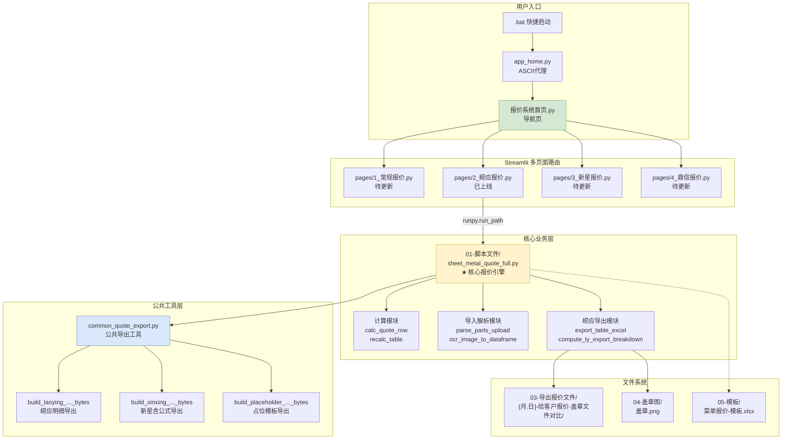
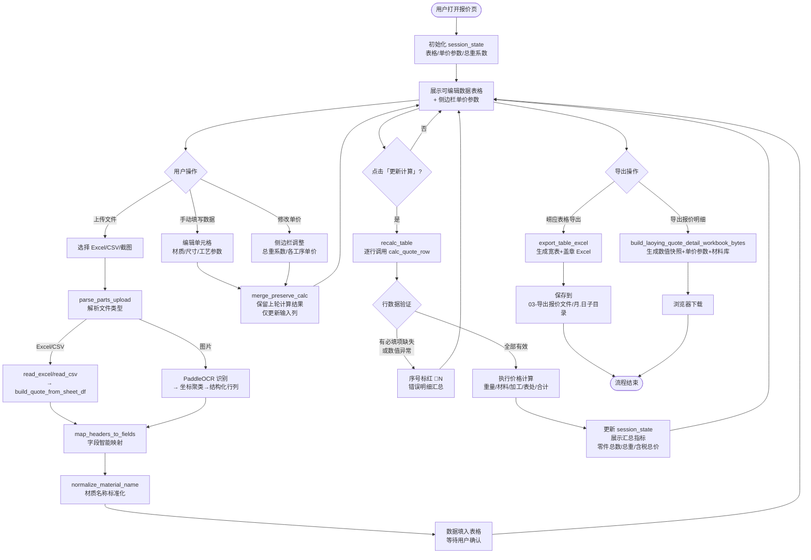
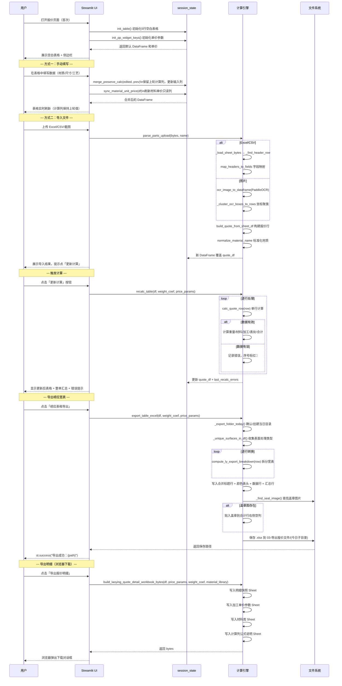
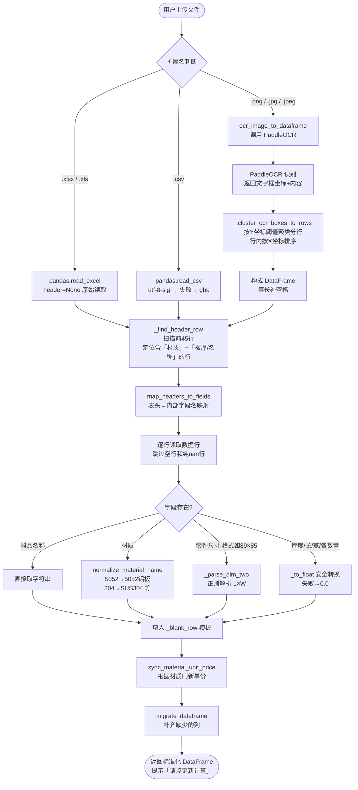
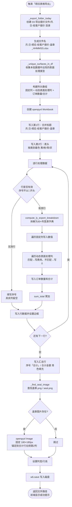
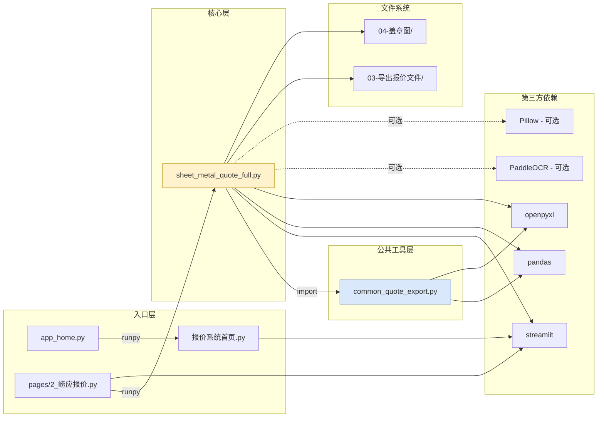

# 青岛宏泰铭润机械 · 钣金智能报价系统 — 系统设计文档

> 文档版本：v1.0  
> 最后更新：2026-03-25  
> 作者：AI 辅助整理（基于现有代码库深度分析）

---

## 目录

1. [项目概览](#1-项目概览)
2. [当前目录结构](#2-当前目录结构)
3. [优化后目录结构建议](#3-优化后目录结构建议)
4. [各模块功能说明](#4-各模块功能说明)
5. [核心计算逻辑说明](#5-核心计算逻辑说明)
6. [系统整体架构图](#6-系统整体架构图)
7. [主报价流程图](#7-主报价流程图)
8. [用户操作时序图](#8-用户操作时序图)
9. [数据导入流程图](#9-数据导入流程图)
10. [Excel 导出流程图](#10-excel-导出流程图)
11. [模块间依赖关系](#11-模块间依赖关系)
12. [关键数据结构说明](#12-关键数据结构说明)
13. [潜在风险与优化建议](#13-潜在风险与优化建议)

---

## 1. 项目概览

本系统是基于 **Streamlit** 构建的钣金件批量智能报价 Web 应用，服务于青岛宏泰铭润机械内部报价流程。

### 核心能力

| 能力 | 说明 |
|------|------|
| 批量录入 | 支持手工逐行填入或批量粘贴 Excel 数据 |
| 自动计算 | 按材质、尺寸、工艺参数一键重算所有行的含税价格 |
| 文件导入 | 支持 Excel / CSV / 截图（OCR）导入柏楚激光软件导出的零件表 |
| 崂应导出 | 导出带颜色分区、自动汇总、可贴盖章图的宽表 Excel |
| 明细导出 | 导出含当前价格快照、加工单价参数、材料库、公式说明的明细表 |
| 多客户路由 | 通过首页导航进入不同客户专属报价页，互不干扰 |

### 技术栈

- **前端框架**：Streamlit 1.28+（多页面应用）
- **数据处理**：Pandas 1.3+
- **Excel 读写**：openpyxl 3.0+
- **图片 OCR**（可选）：PaddleOCR
- **运行环境**：Python 3.12（Windows + PowerShell）

---

## 2. 当前目录结构

```
崂应报价系统/
├── 报价系统首页.py          # Streamlit 多页面主入口（中文文件名）
├── app_home.py              # ASCII 启动代理（供 .bat 绕开中文路径问题）
├── common_quote_export.py   # 各客户导出工具（崂应/新星/占位三套）
│
├── pages/                   # Streamlit 多页面目录（自动注册为侧边栏页）
│   ├── 1_钣金报价.py        # 待更新占位（常规报价）
│   ├── 2_崂应报价.py        # 已上线：用 runpy 加载核心脚本
│   ├── 3_菜单报价.py        # 新星报价（待更新）
│   └── 4_菜单脚本.py        # 鼎信报价（待更新）
│
├── 01-脚本文件/
│   ├── sheet_metal_quote_full.py   # ★ 核心报价引擎（全量逻辑）
│   └── requirements_streamlit.txt  # Python 依赖清单
│
├── 02-启动脚本页面/
│   ├── 启动崂应报价.bat      # 快捷启动：直接跑核心脚本
│   └── 启动多客户系统.bat    # 快捷启动：跑首页多导航版本
│
├── 03-导出报价文件/          # 导出目录根（自动按日期建子文件夹）
│   └── {月.日}-给客户报价-盖章文件对比/
│       └── {月.日}-崂应-给客户报价-盖章_{HHMMSS}.xlsx
│
├── 04-盖章图/
│   ├── 盖章.png              # 优先使用
│   └── seal.png              # 备用
│
├── 05-模板/
│   └── 菜单报价-模板.xlsx
│
├── __pycache__/
└── docs/                    # 设计文档目录（本文件所在位置）
    └── system-design.md
```

---

## 3. 优化后目录结构建议

> 当前代码已经可正常运行。以下是面向**可维护性与可扩展性**的重组建议，不影响现有功能逻辑。

```
崂应报价系统/
├── app_home.py                  # ASCII 启动代理（保留）
├── 报价系统首页.py              # 多页面主入口（保留）
├── common_quote_export.py       # 公共导出工具（保留）
│
├── core/                        # ★ 新增：核心逻辑层（从大脚本拆出）
│   ├── __init__.py
│   ├── config.py                # 全局常量：材质库、表面处理、默认单价、路径
│   ├── calculator.py            # 报价计算函数：calc_quote_row / recalc_table
│   ├── data_io.py               # 数据导入：parse_parts_upload / OCR / 字段映射
│   └── excel_export.py          # 导出逻辑：export_table_excel / 盖章 / 宽表拆分
│
├── pages/                       # Streamlit 多页面（保留结构，完善命名）
│   ├── 1_常规报价.py            # 占位页（可独立）
│   ├── 2_崂应报价.py            # 已上线（改为 import core，不依赖 runpy）
│   ├── 3_新星报价.py            # 新星客户（共用 core，改单价参数与导出格式）
│   └── 4_鼎信报价.py            # 鼎信客户（同上）
│
├── scripts/                     # 原 01-脚本文件（保留但改名）
│   ├── sheet_metal_quote_full.py   # 保留作为单独运行入口（可独立跑）
│   └── requirements.txt
│
├── launchers/                   # 原 02-启动脚本页面
│   ├── start_laoying.bat
│   └── start_multicustomer.bat
│
├── exports/                     # 原 03-导出报价文件（建议改英文路径防编码问题）
├── seals/                       # 原 04-盖章图
├── templates/                   # 原 05-模板
│
└── docs/
    ├── system-design.md         # 本文件
    └── changelog.md             # 版本变更记录
```

**拆分收益：**

| 问题 | 现状 | 优化后 |
|------|------|--------|
| `sheet_metal_quote_full.py` 过大（1395行） | 所有逻辑堆在一个文件 | 拆成 config / calculator / data_io / excel_export 四个职责单一模块 |
| 新客户复用困难 | 每次复制整个脚本 | import core.calculator 即可，只改配置与导出格式 |
| 测试覆盖难 | 函数嵌在 main() 流程中 | 独立模块可单独单元测试 |
| 路径中文导致 .bat 编码问题 | 需 app_home.py 绕行 | exports / seals 等目录改 ASCII 名可彻底解决 |

---

## 4. 各模块功能说明

### 4.1 `报价系统首页.py` — 导航层入口

这是整个多客户系统的**门面页**，自身不含任何业务逻辑。

- 设置 Streamlit 全局页面标题与图标
- 用内联 CSS 渲染四个客户入口卡片（已上线/待更新状态差异化显示）
- 通过 `st.page_link` 跳转到 `pages/` 下各个客户页面
- 底部提示说明"新增客户只需在 pages 文件夹新增脚本"

设计原则：**纯导航层，零业务侵入**，任何业务改动均不修改此文件。

---

### 4.2 `app_home.py` — ASCII 启动代理

Windows 命令行（cmd / PowerShell）在中文文件名路径下容易出现编码错误，本文件的唯一职责是：

1. 定位到 `报价系统首页.py` 的绝对路径
2. 用 `runpy.run_path()` 原样执行，相当于对内转发，不改任何逻辑

`.bat` 脚本只需执行 `streamlit run app_home.py`，避免直接传入中文文件名。

---

### 4.3 `pages/2_崂应报价.py` — 崂应客户报价入口

这个文件同样是一个**代理层**：

1. 设置页面标题为"崂应报价"
2. 动态定位 `01-脚本文件/sheet_metal_quote_full.py` 的绝对路径
3. 用 `runpy.run_path()` 执行该脚本，保留其所有界面与计算逻辑
4. 若脚本不存在，提示错误并提供返回首页链接

这样做的好处：崂应报价脚本可以独立运行（直接 `streamlit run sheet_metal_quote_full.py`），也可以嵌入多页面应用，两种方式互不影响。

---

### 4.4 `01-脚本文件/sheet_metal_quote_full.py` — 核心报价引擎 ★

这是整个系统最核心的文件（1395 行），承载了所有业务逻辑，主要分为以下功能区：

#### 全局配置区（第 41-162 行）

定义了系统的所有关键常量：
- **材质库**（`MATERIAL_LIBRARY`）：14 种材质，每种含密度（g/cm³）和单价（元/kg）
- **表面处理类型**（`SURFACE_OPTIONS`）：无、喷粉、喷砂、氧化、抛光、镀锌
- **加工项默认单价**（`get_default_price_params()`）：14 个系数，涵盖切割/打磨/折弯/压铆/攻丝等
- **列定义**：输入列（`INPUT_COLS`）、计算列（`CALC_COLS`）、必填列（`MANDATORY_COLS`）
- **路径配置**：导出目录、盖章图路径、文件命名规则

#### 数据状态管理（第 164-265 行）

- `_blank_row(seq)`：生成一行空白数据模板，材质默认第一项，数值默认 0
- `migrate_dataframe(df)`：兼容旧 session 数据——新增了字段或废弃了字段时，自动补缺列、删旧列，防止 KeyError 崩溃
- `init_table()`：首次加载时初始化 5 行空白表格到 session_state
- `init_pp_widget_keys()`：为侧边栏每个单价 widget 初始化 session_state 键（`pp_cutting_rate` 等）
- `merge_preserve_calc(edited_df, prev_full)`：用户在表格中编辑数据但**未点「更新计算」**时，保留上一轮的重量和金额列，防止表格乱跳

#### 核心计算函数（第 279-447 行）

- `calc_quote_row(row, weight_coef, price_params)`：对**单行**数据执行全量报价计算，返回各费用字段的字典或错误列表
- `recalc_table(df, weight_coef, price_params)`：对整个 DataFrame 逐行调用 `calc_quote_row`，汇总错误行，刷新序号标红（`🔴N`）

#### 崂应导出宽表（第 450-775 行）

- `compute_ly_export_breakdown(row, weight_coef, p)`：将单行数据按崂应客户格式展开为宽表字典（含穿孔单价、沉孔费、折弯费等 30+ 列）
- `export_table_excel(df, weight_coef, price_params)`：生成崂应格式 Excel 文件，含合并标题行、颜色分区表头（黄/粉/青）、动态表面处理列、盖章图贴入、自动汇总行

#### 数据导入解析（第 778-1021 行）

- `normalize_material_name(s)`：将柏楚软件导出的牌号（如 `5052`、`304`）映射到材质库完整名称
- `map_headers_to_fields(headers)`：智能匹配外部表格表头到系统内部字段名（支持模糊匹配，如"零件名称"→"料品名称"）
- `build_quote_from_sheet_df(df)`：从解析后的 DataFrame 逐行提取报价所需字段，填入空白行模板
- `ocr_image_to_dataframe(file_bytes)`：调用 PaddleOCR 识别截图，通过 Y 坐标聚类将文字块重组为结构化行列
- `parse_parts_upload(file_bytes, name)`：总入口，按文件扩展名分派到 Excel/CSV 解析或 OCR 流程

#### Streamlit UI 主函数（第 1023-1394 行）

- 侧边栏：总重系数输入 + 全部单价参数折叠区（支持恢复默认值）
- 主区域：
  - 导入零件表折叠区（文件上传 + 解析按钮）
  - 可编辑数据表格（`st.data_editor`，计算列只读，材质/表面处理为下拉选择）
  - 「更新计算」主按钮（触发全量重算）
  - 「插入行 / 删除选中行」工具按钮
  - 错误提示区（有无效行时展开错误明细）
  - 整单汇总区（零件总数、总重量、含税总价 + 导出按钮组）

---

### 4.5 `common_quote_export.py` — 公共导出工具

这是一个**纯工具模块**，不包含 UI 代码，供各客户报价页复用：

- `build_xinxing_quote_detail_workbook_bytes(...)`：新星客户导出，生成含 Excel 公式的明细表（修改输入值会自动重算），另附单价参数表、材质密度表、使用说明
- `build_laoying_quote_detail_workbook_bytes(...)`：崂应客户导出，生成数值快照 + 加工单价参数 + 材料库 + 计算列公式文字说明
- `build_placeholder_quote_workbook_bytes(...)`：常规/鼎信客户占位，导出空白列头模板

---

## 5. 核心计算逻辑说明

### 5.1 重量计算

```
单件物理重量(kg) = 长(mm) × 宽(mm) × 厚度(mm) × 密度(g/cm³) ÷ 1,000,000
单件毛重(kg)    = 单件物理重量 × 总重系数（默认 1.3，与 Excel 毛重列一致）
总重(kg)        = 单件毛重 × 加工数量
```

> 总重系数用于补偿下料余量，与对应 Excel 报价表的毛重列计算方式完全一致。

---

### 5.2 材料费

```
材料费(元) = 总重(kg) × 材质单价(元/kg)
```

> 材质单价从材质库（`MATERIAL_LIBRARY`）读取，不额外乘损耗率（与 Excel 保持一致）。

---

### 5.3 加工费汇总

| 工序 | 计算公式 |
|------|----------|
| 切割费 | 米数(切割长度) × 厚度(mm) × 切割系数 |
| 打磨费 | 打磨基数 × 加工数量 × 打磨倍率（基数按长/宽是否<200mm 取大/小值） |
| 穿孔费 | 穿孔数量 × 厚度(mm) × 穿孔系数 |
| 焊接费 | 焊接长度(mm) × (系数A + 系数B) |
| 沉孔费 | 沉孔数量 × 沉孔单价 |
| 折弯费 | 折弯单价 × 折弯次数 × 加工数量（铝板/钢分档，长宽>100mm 用大件单价） |
| 压铆费 | 压铆数量 × (压铆单价A + 压铆单价B) |
| 攻丝费 | 攻丝单价 × 攻丝数量 × 加工数量（铝板/钢分档） |
| 激光打标 | 直接填入费用值（不参与公式计算） |
| **总加工费** | 以上各项之和 |

---

### 5.4 表面处理费

| 处理类型 | 计算公式 |
|----------|----------|
| 无 | 0 |
| 喷粉 | 长 × 宽 × 2 ÷ 1,000,000 (m²) × 25(元/m²) × 加工数量 |
| 喷砂 | 长 × 宽 × 2 ÷ 10,000 (dm²) × 1.2 × 加工数量 |
| 氧化 | 长 × 宽 × 2 ÷ 10,000 × 0.8 × 加工数量 |
| 抛光 | 长 × 宽 × 2 ÷ 10,000 × 4 × 加工数量 |
| 镀锌（及其他） | 总重(kg) × 15 |

---

### 5.5 最终价格

```
整单含税总价(元) = 材料费 + 总加工费 + 表面处理费
含税单价(元/件) = 整单含税总价 ÷ 加工数量
```

> 当前实现**含税价直接等于成本合计**，未单独乘税率系数（与现用 Excel 模板保持一致）。新星导出模块中有独立的税率字段，用于新星客户需要税后报价的场景。

---

## 6. 系统整体架构图



---

## 7. 主报价流程图



---

## 8. 用户操作时序图



---

## 9. 数据导入流程图



---

## 10. Excel 导出流程图



---

## 11. 模块间依赖关系



---

## 12. 关键数据结构说明

### 12.1 单行报价数据字典（`_blank_row` 结构）

```python
{
    # 控制列
    "选择": False,           # bool，勾选后可删除
    "序号": "1",             # str，有错误时变为 "🔴1"

    # 输入列（INPUT_COLS）
    "料品名称": "",
    "料号": "",
    "料品规格": "",
    "材质": "6061铝板",      # 从 MATERIAL_LIBRARY 选择
    "材料单价(元/kg)": 32.0, # 只读，随材质自动带出
    "长(mm)": 0.0,
    "宽(mm)": 0.0,
    "厚度(mm)": 0.0,
    "重量(kg)": 0.0,         # 只读，更新计算后填入
    "米数(切割长度)": 0.0,
    "穿孔数量": 0.0,
    "焊接长度(mm)": 0.0,
    "沉孔数量": 0.0,
    "折弯次数": 0.0,
    "压铆数量": 0.0,
    "攻丝数量": 0.0,
    "激光打标": 0.0,
    "表面处理": "无",         # 从 SURFACE_OPTIONS 选择
    "加工数量": 1,

    # 计算列（CALC_COLS，只读）
    "总重(kg)": 0.0,
    "打磨(元)": 0.0,
    "材料费(元)": 0.0,
    "总加工费(元)": 0.0,
    "表面处理费(元)": 0.0,
    "含税单价(元/件)": 0.0,
    "含税总价(元)": 0.0,
}
```

### 12.2 加工单价参数字典（`price_params`）

```python
{
    "cutting_rate": 1.2,       # 切割费率（米数×厚×系数）
    "grinding_small": 0.4,     # 打磨基数（长/宽<200mm）
    "grinding_large": 0.5,     # 打磨基数（否则）
    "grinding_mult": 1.13,     # 打磨倍率
    "pierce_per_t": 0.1,       # 穿孔系数（×厚）
    "weld_a": 40.0,            # 焊接系数A
    "weld_b": 20.0,            # 焊接系数B
    "countersink": 0.3,        # 沉孔单价/个
    "bend_al": 0.5,            # 折弯铝板单价/次·件（长宽≤100）
    "bend_steel": 0.6,         # 折弯钢/不锈钢单价/次·件（长宽≤100）
    "bend_large": 0.7,         # 折弯大件单价（长/宽>100）
    "pem_a": 0.3,              # 压铆单价A
    "pem_b": 0.15,             # 压铆单价B
    "tap_al": 0.4,             # 攻丝铝板单价
    "tap_steel": 0.6,          # 攻丝钢/不锈钢单价
}
```

### 12.3 材质库条目结构

```python
MATERIAL_LIBRARY = {
    "6061铝板": {
        "density": 2.73,      # 密度 g/cm³
        "unit_price": 32.0,   # 材料单价 元/kg
        "category": "铝板",   # 分类（用于导出展示）
    },
    # ... 共 14 种材质
}
```

---

## 13. 潜在风险与优化建议

### 13.1 高风险点（建议优先处理）

| 风险 | 位置 | 说明 | 建议 |
|------|------|------|------|
| 中文路径编码 | `app_home.py` / `.bat` | Windows cmd 下中文目录名可能导致启动失败 | 将 `03-导出报价文件`、`04-盖章图` 等目录改为 ASCII 命名，或确保 .bat 以 UTF-8 编码保存 |
| 导出目录不可写 | `export_table_excel` | 若 `03-导出报价文件` 被其他程序锁定或无写权限，导出会静默失败 | 增加写权限预检，给出更明确的报错提示 |
| OCR 首次启动慢 | `ocr_image_to_dataframe` | PaddleOCR 首次需要下载模型（数百MB），超时或网络问题会导致无提示崩溃 | 加入进度提示和超时保护，建议在 requirements 中单独注明 |
| 价格参数无持久化 | `init_pp_widget_keys` | 用户调整单价后刷新页面会恢复默认值 | 将 `price_params` 持久化到本地 JSON 文件 |

### 13.2 中等风险点（迭代优化）

| 风险 | 说明 | 建议 |
|------|------|------|
| `compute_ly_export_breakdown` 与 `calc_quote_row` 公式重复 | 两函数都实现了完整的价格计算，存在维护双份逻辑的风险 | 重构：`compute_ly_export_breakdown` 内部调用 `calc_quote_row` 获取汇总数值，仅自身负责拆分细项 |
| 大文件导入无进度条 | 超过数百行的 Excel 导入时界面无反馈 | 使用 `st.spinner` 或 `st.progress` 包裹导入过程 |
| `migrate_dataframe` 在每次渲染都调用 | 存在低效的数据拷贝 | 仅在 session 版本号变更时触发迁移 |
| 主脚本1395行过大 | 可读性与测试覆盖困难 | 按"优化目录结构"建议拆分为 core/ 子模块 |

### 13.3 改进方向（长期规划）

- **单价持久化**：将加工单价写入本地 `config.json`，重启后自动恢复
- **多客户复用**：将 `core/calculator.py` 作为通用引擎，各客户页面仅传入不同 `price_params` 和导出模板
- **自动化测试**：为 `calc_quote_row`、`normalize_material_name`、`map_headers_to_fields` 编写单元测试
- **导出历史记录**：在 `03-导出报价文件` 目录下增加 `export_log.csv`，记录每次导出时间、行数、总价
- **盖章图管理**：支持在 UI 内直接上传/切换盖章图，不需手动替换文件

---

## 附录：验证步骤清单

每次修改报价计算相关代码后，请按以下步骤验证：

### 正常路径验证

1. 启动系统：`streamlit run app_home.py`
2. 进入崂应报价页
3. 填写一行：`6061铝板`，`长=100mm`，`宽=100mm`，`厚度=2mm`，`米数=1.5`，`折弯次数=2`，`表面处理=喷粉`，`加工数量=10`
4. 点击「更新计算」
5. 预期：
   - 单件毛重 ≈ `100×100×2×2.73×1.3 ÷ 1e6 ≈ 0.07098 kg`
   - 材料费 = 总重 × 32 ≈ `0.07098 × 10 × 32 ≈ 22.71 元`
   - 切割费 = `1.5 × 2 × 1.2 = 3.6 元`
   - 含税总价 = 材料费 + 加工费 + 表处费
6. 点击「崂应表格导出」，确认文件生成在 `03-导出报价文件/{今日}` 目录下

### 边界路径验证

1. 填写一行，必填项留空（如材质为空），点「更新计算」→ 序号应变红，错误区展示提示
2. 上传一个无「材质」列的 Excel → 应提示「未识别到材质列」
3. 总重系数改为 0.01，验证材料费是否随系数缩小
4. 折弯次数=0、攻丝数量=0 → 折弯费/攻丝费应为 0，含税总价仅含材料+切割+打磨等

---

*文档由 AI 辅助根据代码库自动生成，如有逻辑与实际代码出入，以代码为准。*
