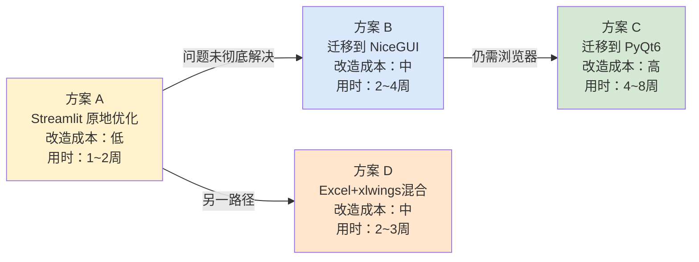
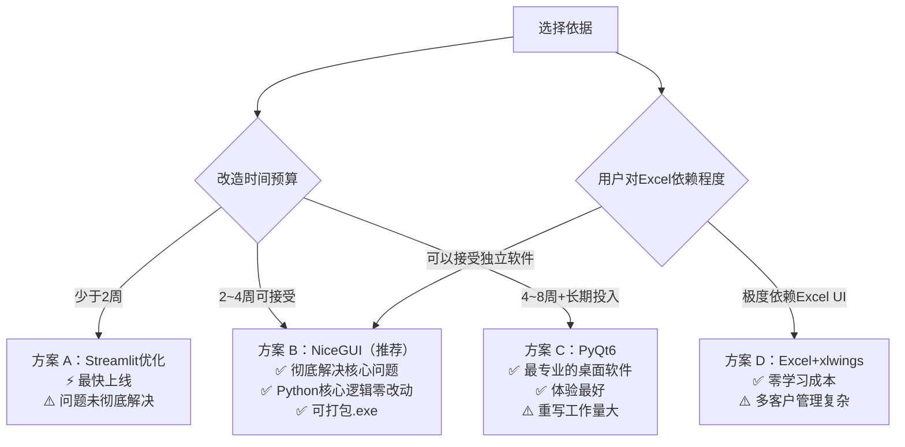

# 钣金报价系统 · 技术选型分析与方案比较

> 文档版本：v1.0  
> 最后更新：2026-03-25  
> 文档类型：技术决策文档（Decision Doc）  
> 使用的 Skill：doc-coauthoring（文档协作工作流）、python-code-review（代码审查视角）

---

## 目录

1. [分析背景与约束条件](#1-分析背景与约束条件)
2. [当前技术选型的核心问题](#2-当前技术选型的核心问题)
3. [问题严重程度矩阵](#3-问题严重程度矩阵)
4. [备选方案概览](#4-备选方案概览)
5. [方案 A：Streamlit 原地优化（零迁移成本）](#5-方案-a-streamlit-原地优化零迁移成本)
6. [方案 B：迁移到 NiceGUI（中等改造）](#6-方案-b-迁移到-nicegui中等改造)
7. [方案 C：迁移到 PyQt6 桌面应用（完整重写）](#7-方案-c-迁移到-pyqt6-桌面应用完整重写)
8. [方案 D：Excel + xlwings 混合方案（最保守）](#8-方案-d-excel--xlwings-混合方案最保守)
9. [方案综合对比](#9-方案综合对比)
10. [决策推荐](#10-决策推荐)
11. [迁移路径规划](#11-迁移路径规划)

---

## 1. 分析背景与约束条件

### 核心使用场景

| 维度 | 实际情况 |
|------|----------|
| 用户群体 | 工厂技术人员，1~2 人使用 |
| 使用频次 | 每天接到客户图纸后即时报价，高频、短会话 |
| 运行环境 | **用户本地 Windows 电脑**，不联外网、不部署服务器 |
| 输入方式 | 手工填写 + 粘贴 Excel 数据 + 导入柏楚激光软件导出文件 |
| 输出要求 | 生成带颜色、带盖章的 Excel 宽表，直接发给客户 |
| 技术背景 | 使用者非开发人员，无法自行排查 Python 环境问题 |
| 扩展需求 | 支持多客户专属报价格式（已有崂应、待上线新星/鼎信） |

### 关键约束

1. **本地运行**：不能依赖云服务、不能要求网络连接（报价时随时可能断网）
2. **一键启动**：技术人员不懂命令行，必须双击即用
3. **数据不丢失**：报价过程中刷新/意外关闭不能丢失已填数据
4. **Excel 输出**：客户习惯 Excel 格式，这一点不可更改
5. **可维护**：只有 1~2 人维护代码，不能引入过于复杂的技术栈

---

## 2. 当前技术选型的核心问题

当前系统使用 **Streamlit** 构建本地 Web 应用。Streamlit 最初是为数据科学家快速演示模型而设计的工具，将其用于工厂日常业务软件存在以下**结构性不匹配**：

### 问题 1：数据不持久——最高风险 🔴

**现象**：页面一刷新，或 Streamlit 进程因内存/超时重启，`session_state` 中所有已填写的报价数据**全部清空**，包括已调整的加工单价参数。

**根因**：Streamlit 的 `session_state` 存储在内存中，不写磁盘。这是 Streamlit 的设计定位——演示工具，不是业务数据存储。

**实际影响**：填了一半的报价表，因为切换窗口触发了 Streamlit 的页面重渲染，数据可能丢失。工厂技术人员不会接受这种行为。

---

### 问题 2：启动方式不友好——中等风险 🟡

**现象**：需要通过 `.bat` 脚本调用 `streamlit run`，启动后在浏览器中打开页面。

**实际问题**：
- `.bat` 文件需要提前正确安装 Python + Streamlit 环境，环境问题技术人员无法自排
- 现有代码中为绕开中文路径编码问题，专门写了一个 `app_home.py` ASCII 代理（这是症状，不是解决方案）
- 浏览器中运行的"软件"对工厂用户来说**认知错位**——他们期望打开一个窗口程序，而不是访问网页

---

### 问题 3：表格编辑体验不佳——中等风险 🟡

**现象**：使用 `st.data_editor` 作为核心录入界面。

**已知问题**：
- 每次交互（包括点击单元格）都可能触发全页重渲染，导致**表格滚动位置丢失**
- 单元格编辑后焦点跳到表格外，需要手动点回去，批量录入效率低
- 不支持多行粘贴（无法像 Excel 那样直接 Ctrl+V 粘贴整列数据）
- 行高/列宽调整不灵活
- 代码中已有注释："改完数据后点表格下方的「更新计算」……减轻表格滚动回跳"——这是变通说明，说明问题存在

---

### 问题 4：无法打包为独立 .exe——低/中风险 🟡

**现象**：Streamlit 应用无法直接用 PyInstaller 打包成单一 `.exe` 分发。

**实际影响**：如果需要在另一台电脑上使用，必须重新安装 Python 环境 + 所有依赖。对工厂环境来说，这是一个显著的部署门槛。

---

### 问题 5：多页面路由机制脆弱——低风险 🟢

**现象**：`pages/2_崂应报价.py` 用 `runpy.run_path()` 动态加载核心脚本，这是一个非常规做法。

**潜在问题**：
- `runpy` 执行的脚本共享进程环境，如果两个客户页面同时使用不同版本的 `session_state` 键，会互相污染
- Streamlit 的 `set_page_config` 只能调用一次，目前通过"主页设置、子页不设置"规避，但稳定性存疑

---

### 问题 6：单价配置无持久化——低风险（当前可接受）🟢

**现象**：`init_pp_widget_keys()` 每次从 `get_default_price_params()` 取默认值。

**影响**：用户在侧边栏调整的加工单价，页面刷新后恢复默认。用户每次都需要重新核对单价是否正确，**容易出现报价错误**。

---

## 3. 问题严重程度矩阵

```
              发生频率 ──────────────────────→ 高频
              │
影    高      │  [数据丢失]          [表格编辑体验]
响    ↑       │  [单价不持久]
程    │       │
度    中      │                    [启动不友好]
      │       │                    [无法打包exe]
      低      │  [路由机制脆弱]
              │
              └────────────────────────────→
                    低频                高频
```

**结论：当前技术选型存在 2 个高影响、高频率的结构性问题（数据丢失、表格编辑体验），需要认真评估是否调整。**

---

## 4. 备选方案概览

根据"本地运行、1~2 人使用、工厂场景"的约束，整理了以下 4 种方案，按改造成本从低到高排序：



---

## 5. 方案 A：Streamlit 原地优化（零迁移成本）

### 方案描述

保持 Streamlit 框架不变，通过以下改进解决最关键的问题：

1. **数据持久化**：将报价表和单价参数写入本地 `autosave.json`，每次触发「更新计算」时自动保存；页面重载时自动恢复
2. **启动优化**：重写 `.bat` 脚本，加入 Python 环境检测和友好错误提示；将中文目录名全部改为 ASCII
3. **表格体验改善**：拆分"输入区"与"结果区"，避免全页重渲染影响焦点；为批量粘贴场景提供文本框粘贴入口

### 改动清单

```python
# 新增：数据自动保存（在 recalc_table 调用后写入）
def autosave(df: pd.DataFrame, price_params: dict, weight_coef: float):
    data = {
        "saved_at": datetime.now().isoformat(),
        "price_params": price_params,
        "weight_coef": weight_coef,
        "rows": df.to_dict(orient="records"),
    }
    AUTOSAVE_PATH.write_text(json.dumps(data, ensure_ascii=False, indent=2), encoding="utf-8")

# 新增：启动时恢复
def autoload() -> Optional[dict]:
    if AUTOSAVE_PATH.exists():
        return json.loads(AUTOSAVE_PATH.read_text(encoding="utf-8"))
    return None
```

### 优点

| 优点 | 说明 |
|------|------|
| 零迁移成本 | 不改框架，现有业务逻辑全部保留 |
| 周期最短 | 1~2 周内可完成 |
| 风险最低 | 改动范围小，不影响现有报价计算正确性 |
| 数据持久化可解决 | JSON 自动保存可以解决最高风险问题 |

### 缺点与残留问题

| 缺点 | 无法通过方案A解决 |
|------|------------------|
| 表格编辑体验 | `st.data_editor` 的交互限制是框架底层决定的，无法根本改善 |
| 无法打包 .exe | Streamlit 架构天然不支持 |
| 浏览器依赖 | 仍需打开浏览器，用户认知仍是"网页"而非"软件" |
| 启动门槛 | 仍依赖 Python 环境，无法零依赖运行 |

### 适合场景

- **短期过渡**：现有系统已在使用中，近期没有精力做大改造
- **用户已适应**：技术人员已经习惯当前操作方式，对已知缺陷有心理预期

---

## 6. 方案 B：迁移到 NiceGUI（中等改造）

### 方案描述

[NiceGUI](https://nicegui.io/) 是一个专门为本地桌面/内网工具设计的 Python UI 框架，与 Streamlit 同为 Python + Web 技术栈，但架构目标完全不同：

- **后端驱动**：UI 逻辑在 Python 中定义，实时双向同步（WebSocket），不像 Streamlit 每次交互重跑脚本
- **数据表格**：内置 AG Grid 组件，支持多行粘贴、列宽拖拽、单元格编辑而不触发全页刷新
- **状态管理**：变量状态在 Python 对象中持久存储，页面刷新不丢数据
- **打包支持**：官方支持 PyInstaller 打包为 `.exe`，`nicegui-pack` 工具一键打包

### 架构对比

```
Streamlit 当前架构：
  用户操作 → 全脚本重跑 → 整页重渲染 → 新 HTML 发送到浏览器

NiceGUI 架构：
  用户操作 → WebSocket 事件 → Python 回调函数 → 仅更新变化的 DOM 节点
```

### 迁移工作量估算

| 模块 | 迁移难度 | 说明 |
|------|----------|------|
| 报价计算逻辑（calc_quote_row 等） | **无需改动** | 纯 Python 函数，框架无关 |
| Excel 导入解析（parse_parts_upload） | **无需改动** | 纯 Python 函数 |
| Excel 导出（export_table_excel） | **无需改动** | openpyxl 代码不变 |
| 侧边栏单价参数 UI | 中等 | 改写为 NiceGUI 的 number input 组件 |
| 数据表格（st.data_editor） | 中等 | 改写为 AG Grid 组件，功能反而更强 |
| 整单汇总指标展示 | 简单 | 改写为 NiceGUI label/card |
| 多客户路由 | 简单 | NiceGUI 有原生路由支持，无需 runpy 技巧 |
| 首页导航 | 简单 | 改写为 NiceGUI 页面 |

**估算总迁移工作量：核心逻辑零改动，UI 层约 2~4 周**

### 示例代码对比

```python
# Streamlit 当前写法
st.number_input("切割系数", min_value=0.0, step=0.001, key="pp_cutting_rate")
df = st.data_editor(quote_df, num_rows="dynamic", disabled=CALC_COLS)
if st.button("更新计算"):
    recalc_table(...)

# NiceGUI 等效写法
with ui.column():
    cutting_rate = ui.number("切割系数", value=1.2, step=0.001, min=0)
    grid = ui.aggrid({"rowData": rows, "columnDefs": col_defs})

    async def on_update():
        data = await grid.get_selected_rows()
        result = recalc_table(data, ...)
        grid.update()  # 仅刷新表格，不重载页面

    ui.button("更新计算", on_click=on_update)
```

### 优点

| 优点 | 说明 |
|------|------|
| 数据不丢失 | 状态在 Python 对象中，与页面渲染解耦 |
| 表格体验大幅提升 | AG Grid 支持多行粘贴、原地编辑、列排序/筛选 |
| 可打包为 .exe | 官方工具支持，分发到其他电脑无需装 Python |
| 仍是 Python | 核心计算逻辑零改动，学习成本低 |
| 中文路径友好 | NiceGUI 对文件系统路径的处理比 Streamlit 更直接 |
| 真正的本地软件 | 可设置为 `native=True`，以窗口模式运行（不显示浏览器地址栏） |

### 缺点

| 缺点 | 说明 |
|------|------|
| 需要重写 UI 层 | 约 2~4 周工作量 |
| 社区相对小 | NiceGUI 比 Streamlit 社区小，遇到问题可参考资料较少 |
| 底层仍是 Web 技术 | 尽管可以`native`模式运行，本质还是 Chromium 内嵌浏览器 |

### 适合场景

- **推荐选项**：在可接受中等改造成本的前提下，这是最佳平衡点
- 能彻底解决数据持久化和表格体验问题
- 核心报价逻辑无需重写，迁移风险可控

---

## 7. 方案 C：迁移到 PyQt6 桌面应用（完整重写）

### 方案描述

使用 [PyQt6](https://pypi.org/project/PyQt6/) 或 [PySide6](https://pypi.org/project/PySide6/) 构建原生 Windows 桌面应用，并用 PyInstaller 打包为独立 `.exe`。

这是**技术上最彻底的解决方案**，同时也是成本最高的。

### 技术架构

```
PyQt6 应用结构：
  main.exe（单文件，无需安装 Python）
  ├── 主窗口（QMainWindow）
  │   ├── 菜单栏：文件/客户/帮助
  │   ├── 侧边参数面板（QDockWidget）
  │   │   └── 各工序单价输入框（QDoubleSpinBox）
  │   └── 中央内容区（QTabWidget，按客户分 Tab）
  │       ├── Tab1: 崂应报价（QTableWidget）
  │       ├── Tab2: 新星报价
  │       └── Tab3: 鼎信报价
  └── 状态栏：显示总件数/总重/含税总价
```

### 核心组件选型

| 功能需求 | PyQt6 组件 |
|----------|-----------|
| 数据表格 | `QTableWidget` 或集成 Qt6 的 `QAbstractTableModel` |
| 下拉选择（材质/表面处理） | `QComboBox` 代理 |
| 数字输入 | `QDoubleSpinBox` |
| 文件上传 | `QFileDialog` |
| 自动保存 | `QTimer` 每 30 秒触发，写 JSON |
| 打包 | `PyInstaller --onefile` |

### 优点

| 优点 | 说明 |
|------|------|
| 真正的桌面软件 | 原生窗口，双击 .exe 即用，无需任何前置安装 |
| 完全无浏览器依赖 | 不需要 Chrome/Edge |
| 最佳表格编辑体验 | `QTableWidget` 支持原生多行粘贴，行为和 Excel 接近 |
| 数据绝对持久 | 可实现每次按键后自动保存草稿 |
| 离线能力最强 | 打包后完全离线运行，无任何网络依赖 |
| 专业感最强 | 外观和操作与其他工业软件一致 |

### 缺点

| 缺点 | 说明 |
|------|------|
| 重写工作量大 | UI 层需要完全重写，估计 4~8 周 |
| 技术栈迁移风险 | PyQt6 开发范式与 Streamlit 差异很大，需要熟悉 |
| 调试难度较高 | GUI 应用的调试比 Web 应用复杂 |
| 打包体积大 | `.exe` 文件通常 50~150 MB（含 Python 运行时） |
| 维护门槛略高 | 后续添加新功能需要熟悉 Qt 组件体系 |

### 适合场景

- **长期目标**：如果计划将系统使用 3~5 年以上，这是最稳固的基础
- **多台电脑部署**：需要发给多个车间技术人员用，.exe 分发最方便
- 对"专业软件"有强需求（如对外展示、向管理层汇报用）

---

## 8. 方案 D：Excel + xlwings 混合方案（最保守）

### 方案描述

将 Python 核心计算逻辑暴露为 [xlwings](https://www.xlwings.org/) 宏，在 Excel 中直接触发报价计算，Excel 本身既是界面也是输出文件。

### 工作方式

```
Excel 工作簿（崂应报价模板.xlsm）
├── 工作表：报价录入
│   ├── 用户在表格中直接填写（完全符合现有习惯）
│   └── 按钮「计算报价」→ 触发 xlwings 调用 Python
├── 工作表：参数设置（加工单价等）
└── 工作表：导出预览

Python 后台（xlwings 宏）
├── 读取 Excel 中填写的数据
├── 调用 calc_quote_row / recalc_table（不改动）
└── 将结果写回 Excel 对应单元格
```

### 优点

| 优点 | 说明 |
|------|------|
| 用户最熟悉 | 技术人员天天用 Excel，操作零学习成本 |
| Excel 原生表格编辑 | 多行粘贴、单元格格式、Ctrl+Z 撤销全都支持 |
| 数据自动持久 | Excel 文件随手保存，Ctrl+S 即完成 |
| 导出即格式 | Excel 本身就是输出，无需额外导出步骤 |
| 核心逻辑零改动 | Python 计算函数不需要改 |

### 缺点

| 缺点 | 说明 |
|------|------|
| 需要安装 xlwings + Python | 仍有环境依赖问题（比 Streamlit 稍好，xlwings 可以打包为加载项） |
| Excel 必须是桌面版 | 不支持 Excel Online / WPS（WPS 的 xlwings 支持有限） |
| 多客户模板管理复杂 | 每个客户需要维护一套 .xlsm 文件，版本同步麻烦 |
| 调试体验差 | xlwings 错误提示不如纯 Python 直接 |
| OCR 导入功能无法复用 | 图片解析逻辑无法直接嵌入 Excel |

### 适合场景

- 用户对 Excel 有强烈偏好，不愿接受任何"软件界面"
- 仅需要报价计算，不需要 OCR 图片导入
- 现有工作流已深度依赖 Excel（如向客户发送文件后需要客户直接修改）

---

## 9. 方案综合对比

### 评分矩阵（满分 5 分）

| 评估维度 | 权重 | 方案 A<br>Streamlit优化 | 方案 B<br>NiceGUI | 方案 C<br>PyQt6 | 方案 D<br>Excel+xlwings |
|----------|------|:-----------------------:|:-----------------:|:---------------:|:-----------------------:|
| **数据不丢失** | 30% | 3 ⭐⭐⭐ | 5 ⭐⭐⭐⭐⭐ | 5 ⭐⭐⭐⭐⭐ | 5 ⭐⭐⭐⭐⭐ |
| **表格编辑体验** | 20% | 2 ⭐⭐ | 4 ⭐⭐⭐⭐ | 5 ⭐⭐⭐⭐⭐ | 5 ⭐⭐⭐⭐⭐ |
| **一键启动/部署** | 15% | 2 ⭐⭐ | 4 ⭐⭐⭐⭐ | 5 ⭐⭐⭐⭐⭐ | 3 ⭐⭐⭐ |
| **改造成本（低=好）** | 15% | 5 ⭐⭐⭐⭐⭐ | 3 ⭐⭐⭐ | 1 ⭐ | 3 ⭐⭐⭐ |
| **多客户可扩展性** | 10% | 3 ⭐⭐⭐ | 4 ⭐⭐⭐⭐ | 4 ⭐⭐⭐⭐ | 2 ⭐⭐ |
| **代码可维护性** | 10% | 2 ⭐⭐ | 4 ⭐⭐⭐⭐ | 4 ⭐⭐⭐⭐ | 2 ⭐⭐ |
| **加权总分** | | **2.85** | **4.10** | **4.20** | **3.90** |

> 方案 A 数据持久化打 3 分而非 1 分，因为 JSON 自动保存**可以在 Streamlit 中实现**，但有边界条件（进程崩溃时有丢失窗口）。

### 关键差异汇总



---

## 10. 决策推荐

### 推荐路径：分两步走

```
【现在 - 1~2周内】方案 A 补丁
  ↓ 解决最高风险问题（数据丢失 + 单价持久化）
  ↓ 改造成本：约 3 天
  
【中期 - 1~2个月内】方案 B 迁移
  ↓ 核心逻辑零改动，仅重写 UI 层
  ↓ 彻底解决所有结构性问题
  ↓ 可打包 .exe，支持更多用户部署
```

### 方案 A 补丁（立即可做，3 天内）

这是不管最终选哪个方向都**必须做**的最小补丁：

- [ ] **任务 1**：在 `recalc_table` 调用后增加 `autosave_to_json()`，保存报价表到 `autosave.json`
- [ ] **任务 2**：在 `init_table()` 中增加从 `autosave.json` 恢复逻辑
- [ ] **任务 3**：将加工单价参数也纳入自动保存/恢复（解决侧边栏单价刷新后丢失问题）
- [ ] **任务 4**：将 `03-导出报价文件`、`04-盖章图`、`05-模板` 改为 ASCII 目录名（解决编码问题）

### 方案 B 迁移（推荐中期目标）

迁移策略：**计算逻辑复用，仅重写 UI 层**

```python
# 迁移后的 core/ 模块结构（与方案无关，任何框架都可用）
core/
├── config.py        # 材质库、单价默认值、常量
├── calculator.py    # calc_quote_row, recalc_table
├── data_io.py       # parse_parts_upload, OCR
└── excel_export.py  # export_table_excel

# NiceGUI UI 层（仅替换 Streamlit 的 main() 函数）
ui/
├── main_window.py   # 主窗口布局
├── sidebar.py       # 单价参数面板
└── quote_table.py   # AG Grid 报价表格
```

### 什么情况下选方案 C（PyQt6）？

如果以下任一条件成立，应直接跳到方案 C：
- 需要将系统分发给 3 台以上电脑使用
- 需要脱离所有网络/浏览器环境运行
- 对外（客户/管理层）展示时对"专业感"有明确要求
- 有 4 周以上的开发时间预算

---

## 11. 迁移路径规划

### 方案 A 补丁计划（针对立即上线）

| 步骤 | 文件 | 改动内容 | 估时 |
|------|------|----------|------|
| 1 | `sheet_metal_quote_full.py` | 增加 `autosave_to_json()` 和 `autoload_from_json()` | 2h |
| 2 | `sheet_metal_quote_full.py` | 修改 `init_table()` 支持恢复逻辑 | 1h |
| 3 | `sheet_metal_quote_full.py` | 修改 `init_pp_widget_keys()` 从持久化文件读单价 | 1h |
| 4 | 目录重命名 | `03-导出报价文件` → `exports`，`04-盖章图` → `seals` | 0.5h |
| 5 | `sheet_metal_quote_full.py` | 同步更新路径常量 | 0.5h |

### 方案 B 迁移计划（分阶段）

```
阶段一（第1周）：代码重构
├── 将 sheet_metal_quote_full.py 拆分为 core/ 子模块（不改功能）
├── 验证：现有 Streamlit 版本仍可正常运行
└── 验证：core/ 中的函数单独可 import 使用

阶段二（第2~3周）：NiceGUI UI 重写
├── 搭建 NiceGUI 应用骨架（主窗口、路由、侧边栏）
├── 接入 AG Grid 表格组件，对接 core.calculator
├── 接入文件上传/导入功能
└── 接入 Excel 导出按钮

阶段三（第4周）：测试与打包
├── 验证所有计算公式与现有结果一致（对比测试）
├── 测试各种边界情况（空值/异常值/大文件导入）
├── PyInstaller 打包为 .exe
└── 在另一台未安装 Python 的电脑上测试运行
```

---

*本文档基于 system-design.md 中的系统分析结果，结合"1~2人工厂本地使用"的核心约束撰写。技术选型建议以实际团队工作量和时间预算为最终决策依据。*
